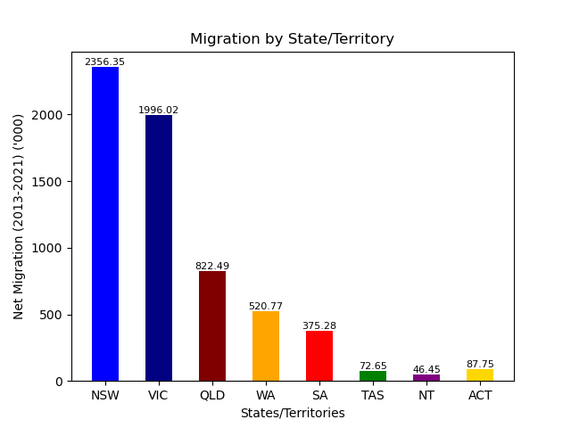
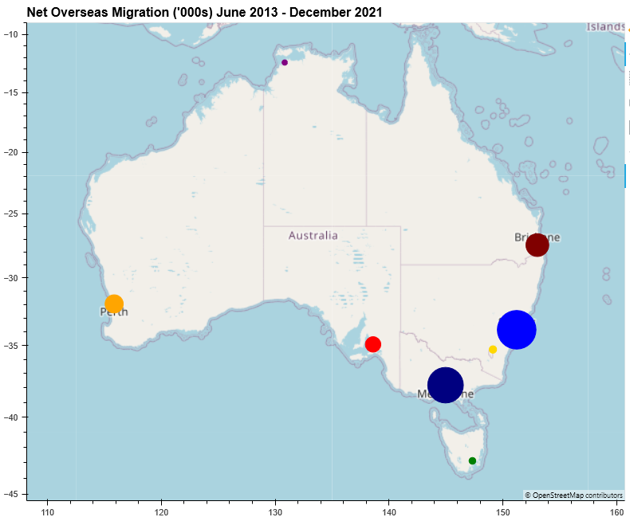
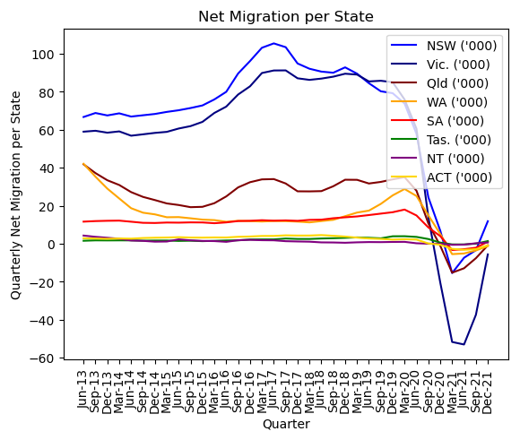
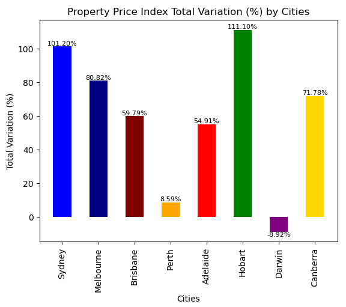
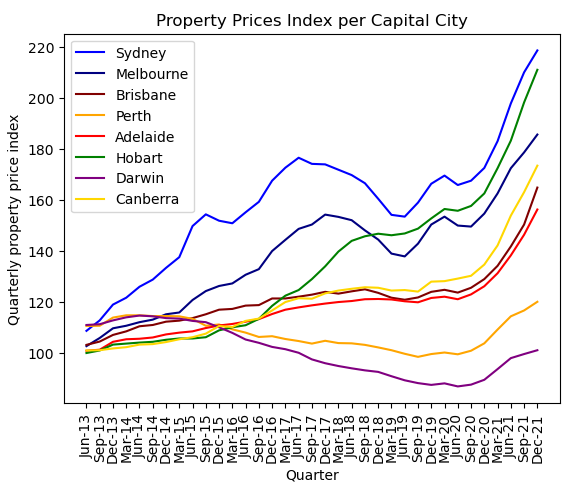
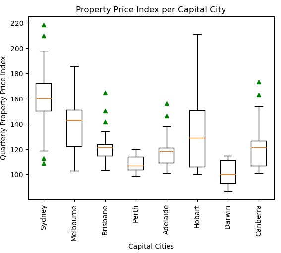
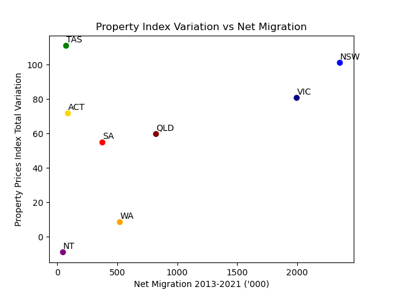
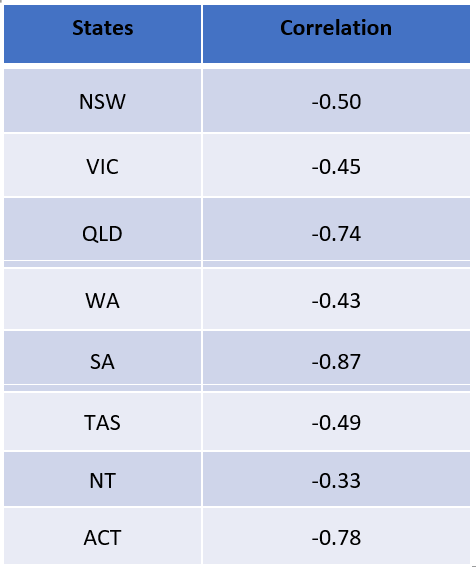
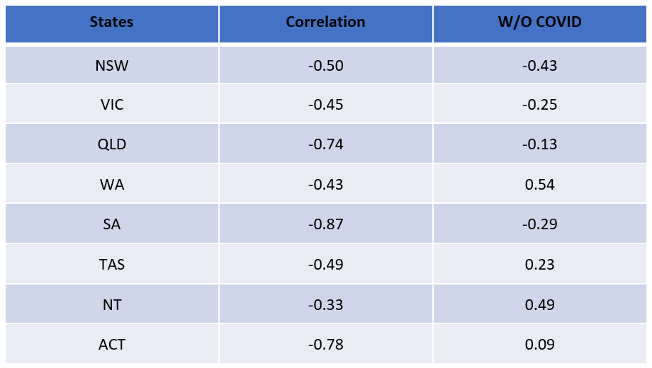
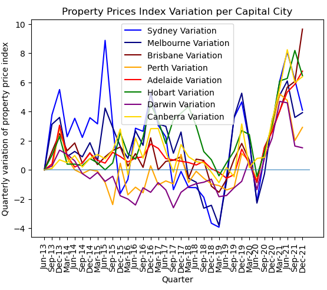

# Project-1-Group-2

### Group members:

   Fabiano Santos
   
   Lewis Trenerry
   
   Liwei Jiang
   
   Simone Nagel
    
    
# Project title: A snapshot of net overseas migration and housing prices in Australia between June 2013 - December 2021

### Abstract
This project investigates whether there is a relationship between net overseas migration and property prices in Australia over the period June 2013 to December 2021. The Australian Bureau of Statistics (ABS) was the key data source for researching the impact of net overseas migration on different states/territories (and their associated capital cities), aiming to address conflicting hypotheses in the media whether a relationship does in fact exist. 
The project involved data cleansing processes to merge and filter data, followed by data analytics through visualizations. The findings suggest inconclusive evidence of a direct correlation between net overseas migration and property prices across Australia. Some of the current media speculation suggesting a strong positive relationship existing between the two variables is incorrect and premature.

### Introduction
There has been discussion in the media about overseas migration fuelling property price increases in Australia. An article in the Australian Financial Review (Kehoe, 2024) proposes migration in Australia has materially influenced rising property prices. Conversely an article from The Guardian (Nicholas, 2023) suggests that there is no conclusive evidence on migration affecting the Australian housing market.  As a team we set out to support or reject these conflicting hypotheses, and developed the following research questions.

### Research questions:
1). What were the states/territories most and least impacted by overseas migration in the last 10 years?

2). What were the capital cities most and least impacted by the rise in property prices in that same period?

3). Is there any correlation between overseas migration and property prices?

### Data cleansing

The ABS separated the data for net overseas migration in two different CSV files, one for 'larger states' including NSW, VIC, QLD, and WA (Australian Bureau of Statistics, 2022a) and 'smaller states' including SA, TAS, NT, and ACT (Australian Bureau of Statistics, 2022b). The first task was to combine these two CSV files using the 'pd.merge' function into one dataframe, using the common variable of 'quarter'. The ABS data for residential property price index in capital cities (Australian Bureau of Statistics, 2022c) was also brought into its own data frame. 

The net overseas migration data spanned from Jun-13 to Jun-23, whilst the residential property price index in capital cities data spanned Dec-11 to Dec-21 (when the ABS ceased production of this data). The team therefore decided to analyse the period Jun-13 to Dec-21 whereby we had data for each variable available. We acknowledge this as a limitation of our research. Another limitation of our research is that net overseas migration data is recorded for each state/territory, whilst residential property price indexes are recorded for capital cities. Although this is a limitation, we decided to proceed as over two thirds of Australia’s population is centred in Australian Capital cities (Australian Bureau of Statistics, 2022d), hence we extrapolated that most overseas migrants would also reside in Australian capital cities.

The 'dropna' function was used to remove rows with no data. Research (Pandas, 2024) was conducted on how to remove rows of data not in the Jun-13 to Dec-21 timeframe. The 'str.match' function was used to remove non-date values, and then the quarter text format was converted to datetime format ‘pd.to_datetime’ to enable filtering. This was then filtered for values less than or equal to Dec-21 for migration data, and greater than Jun-13 for property price index data. The ‘Quarter’ datetime format was then converted back to the original format (using ‘dt.strftime’ function) for cleaner visualisation. Furthermore, the property price index columns were reorganised, so that the city columns aligned with the corresponding states migration data.

Finally as the migration data frame is recorded in thousands (rounded) whilst the property price index data used a reference period of 2011-12 for all city indexes, the data was replicated in both cleaned data frames to show a relative percentage change (rounded to two decimal places) from the preceding quarter utilising the ‘pct_change’ function. This enabled further data analysis, allowing a comparison between the rate of change between each variable on a quarter-by-quarter basis.

### 1). What were the states/territories most and least impacted by overseas migration in the last 10 years?

In order to find out what states/territories were most and least impacted by overseas migration in the last 10 years, we used line, bar, and map graphs/visualisations be able to draw insights from the data.

From the bar chart, we can see the stark contrast of the Northern Territory, which had experienced the least migration of 46.45 thousand migrants during the researched time period, compared to NSW which had experienced the most net overseas migrants with 2356.35 thousand. 

We can also see that the mainland east coast states who traditionally have a higher population than the rest of the country, had the largest net overseas migration compared to the smaller states/territories in the researched time period. This map was able to visually confirm our own expectations given our knowledge of Australia's population distribution.

As shown in the above line chart, we can conclude that NSW and Victoria experienced the highest levels of net overseas migration in the years preceeding 2020. Interestingly these states also experienced the most drastic reduction in net migration, likely due to border closures during the COVID period from late 2020 to mid 2021. The line chart also shows a relatively flatter and less volatile level of overseas migration for the small states/territories aross the researched time period.

### 2). What were the capital cities most and least impacted by the rise in property prices in that same period?

To identify which state/territory has the highest and lowest housing price index movements between June 2013 and December 2023, as reflected in the housing price for the capital cities, we generated the bar graph above to display the total variation from the beginning to the end of the period. As shown below, the capital city that has the the highest Property Price Index Total Variation (%) interestingly was Hobart, which increased 111.10% during the researched time period. The only city where the Property Price Index Total Variation (%) decreased was Darwin (-8.92%). The housing price in the capital city would be expected to be largely in line with the trend in the rest of the state state.

The housing price has, in general, presented increasing trend for 6 of the capital cities. Perth moved independently by first dipping and then surging to finish overall relatively flat in the research period, and Darwin presenting a declining trend. The dynamic changes of housing price in Melbourne and Sydney are also worth noting. These two capital cities follow almost identical trends, perhaps not surprising as they are strong blue chip property markets. Hobart was a surprisingly strong performer, and overtook Melbourne in late 2018 to end the research period with the second highest growth in Property Price Index. Medium sized cities Brisbane, Adelaide, and Canberra all performed modestly until a strong surge beginning in 2020. 

The boxplot interestingly shows the presence of outliers in our data set. There are 9 upper boundary outliers, spread across Sydney, Brisbane, Adelaide, and Canberra, and only two lower boundary outliers both residing in Sydney. This demonstrates the volatility the property market has experienced, and has been taken into consideration for our analysis regarding the correlation between net overseas migration and property prices

### 3). Is there any correlation between overseas migration and property prices?

Until now, we have analysed the variables independently and which states and capitals have presented the highest and lowest impacts. 

But how do they interact with each other? Is there any correlation? Some people suggest that the increase in housing prices can be explained by the rise in migrants coming to Australia. Do we have data to support those allegations?

We can use the quarterly data from June 2013 to December 2021, comprising 35 measurements to investigate these questions.

By comparing the total net migration per state within that period with the property price index total variation in that same period, we have the following graph:

The scatter plot above indicates that the results vary significantly from state to state. For instance, Tasmania and Northern Territory recorded the lowest net migration figures. Interestingly, these states differ in terms of the variation in the property price index. Tasmania had the highest positive variation, whereas the Northern Territory had the highest negative variation. 

Western Australia, Victoria and New South Wales followed a similar ascending line in the chart, but the Australian Capital Territory, South Australia, and Queensland presented random patterns.

The result is also inconclusive if we look at the numbers and calculate the correlation between these two variables per state.

At first glance, it may suggest a strong negative correlation between them. 

However, it is important to keep in mind that part of the data available refers to a period that was heavily affected by the COVID-19 pandemic, which can drastically influence the data.

Let’s make an exercise and limit the measurements to the period not affected by the pandemic. As a result, we observe that the results are higher in all states, moving from negative to positive indexes in some of them. Nevertheless, it is still insufficient to establish a significant correlation between the variables.

From a more visual perspective, it is clear from the line charts that these two indexes have entirely different and unrelated behaviours. 

Finally, after analyzing the available data, we cannot conclude that the property prices index is directly and significantly affected by the number of migrants entering or leaving Australia. While it may be one of the factors that impact the housing market, any claims suggesting that one causes the other are incorrect and premature.

### References

Australian Bureau of Statistics. (2022a). "Graph 5.1 Net overseas migration(a) - larger states(b) - year ending" [CSV file]. Retrieved from https://www.abs.gov.au/statistics/people/population/overseas-migration/latest-release#cite-window1

Australian Bureau of Statistics. (2022b). "Graph 5.2 Net overseas migration(a) - smaller states and territories(b) - year ending" [CSV file]. Retrieved from https://www.abs.gov.au/statistics/people/population/overseas-migration/latest-release#cite-window1

Australian Bureau of Statistics. (2022c). "Residential Property Price Indexes, capital cities" [CSV file]. Retrieved from https://www.abs.gov.au/statistics/economy/price-indexes-and-inflation/residential-property-price-indexes-eight-capital-cities/latest-release

Australian Bureau of Statistics. (2022d). Location Census. Australian Bureau of Statistics. Retrieved from https://www.abs.gov.au/statistics/people/people-and-communities/location-census/latest-release

Kehoe, J. (2024, January 19). Migration boosts house prices but not inflation. Australian Financial Review. Retrieved from https://www.afr.com/policy/economy/migration-boosts-house-prices-but-not-inflation-20240119-p5eyni#:~:text=Migration%20surges%20in%20Australia%20have,the%20International%20Monetary%20Fund%20suggests

Nicholas, J. (2023, December 12). Australia sees immigration data spike driving migration rate and housing prices. The Guardian. Retrieved from https://www.theguardian.com/news/datablog/2023/dec/12/australia-immigration-data-spike-migration-rate-housing-prices

OpenAI. (2022). ChatGPT [Computer software]. 
Retrieved from https://openai.com/chatgpt

Pandas. (2024). pandas.Series.str.match. pandas documentation.
Retrieved from https://pandas.pydata.org/docs/reference/api/pandas.Series.str.match.html
